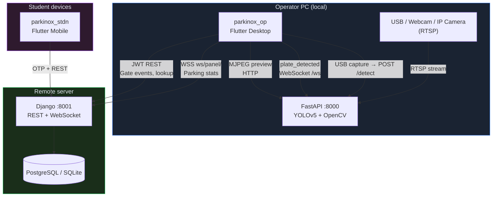

<p align="center">
  
</p>

<h1 align="center">Parkinox v3</h1>

<p align="center">
  <strong>Smart university parking — Iranian plate recognition, operator gates, and student mobile access</strong>
</p>

<p align="center">
  
  
  
  
  
</p>

<p align="center">
  <a href="#-quick-start">Quick Start</a> •
  <a href="#-architecture">Architecture</a> •
  <a href="#-repository-layout">Layout</a> •
  <a href="docs/README.md">Documentation</a> •
  <a href="#-service-ports">Ports</a>
</p>

---

## Overview

**Parkinox v3** is an end-to-end parking management platform designed for Iranian universities. It combines:

- **Real-time license plate recognition** (Persian plate format) via YOLOv5
- **Operator gate control** with live camera preview, approval workflows, and countdown timers
- **Student mobile app** for reservations, wallet top-up, and plate registration
- **Django REST API** for accounts, parking sessions, gate events, wallets, and reporting

Detection runs **locally on the operator PC** (FastAPI + OpenCV + YOLO). The remote Django server handles business logic, authentication, and persistence — cameras and AI never leave the operator machine.

---

## Architecture



| Layer | Responsibility | Runs on |
|-------|----------------|---------|
| **parkinox_op** | Camera preview, plate approval UI, gate actions | Operator PC |
| **FastAPI (Core)** | YOLO detection, RTSP ingest, MJPEG stream, WS events | Operator PC |
| **Django (backend)** | Auth, wallets, sessions, gate events, reports | Server |
| **parkinox_stdn** | Student registration, plates, reservations | Mobile |

> Deep dive: [docs/ARCHITECTURE.md](docs/ARCHITECTURE.md)

---

## Repository layout

```
Parkinox-v3-M/
├── Core/                    # Local AI bridge (FastAPI + YOLOv5)
│   ├── fastapi_app.py       # Detection API, camera config, WebSocket
│   ├── camera_stream_service.py
│   ├── plate_detector.py
│   └── models/              # plateYolo.pt, CharsYolo.pt
│
├── backend/                 # Django REST API + operator WebSocket
│   ├── accounts/            # Auth, students, operators
│   ├── parking/             # Gate events, sessions, rates
│   ├── plates/              # Plate registry
│   ├── wallets/             # Wallet & top-up
│   └── reports/             # Reporting endpoints
│
├── parkinox_op/             # Operator dashboard (Flutter, Windows-first)
│   ├── lib/
│   │   ├── ui/dashboard/    # Cameras, approval panels, stats
│   │   ├── providers/       # Riverpod state (detection, WS, parking)
│   │   └── data/services/   # FastAPI, Django, WebSocket clients
│   └── build_windows.bat    # Release build script
│
├── parkinox_stdn/           # Student mobile app (Flutter)
├── yolov5/                  # YOLOv5 dependency (git submodule / vendored)
├── docs/                    # Project documentation
├── run_all.bat              # Start FastAPI + Django + Operator app
├── run_fastapi.bat
├── run_django.bat
└── run_flutter.bat
```

---

## Quick start

### Prerequisites

| Tool | Version | Notes |
|------|---------|-------|
| **Python** | 3.10+ | FastAPI venv in `Core/`, Django venv in `backend/` |
| **Flutter** | 3.35.3+ | Dart 3.9.2+ |
| **Visual Studio** | 2022 or 2026 | Windows desktop builds |
| **FFmpeg** | Latest | RTSP/IP camera support (OpenCV backend) |
| **CUDA** | Optional | GPU acceleration for YOLO |

### One-command launch (Windows)

```bat
run_all.bat
```

This starts:

1. **FastAPI** on `http://localhost:8000`
2. **Django** on `http://localhost:8001`
3. **Operator app** (`parkinox_op.exe` or builds it first)

### Manual setup

```bat
:: 1. FastAPI (detection)
cd Core
python -m venv venv
venv\Scripts\activate
pip install -r requirements.txt
python fastapi_app.py

:: 2. Django (backend) — separate terminal
cd backend
python -m venv env
env\Scripts\activate
pip install -r requirements.txt
copy .env.example .env
python manage.py migrate
python manage.py runserver 8001

:: 3. Operator app — separate terminal
cd parkinox_op
flutter pub get
flutter run -d windows
```

Full guide: [docs/GETTING_STARTED.md](docs/GETTING_STARTED.md)

---

## Service ports

| Service | Default URL | Purpose |
|---------|-------------|---------|
| FastAPI | `http://localhost:8000` | Plate detection, IP camera streams |
| FastAPI WS | `ws://localhost:8000/ws` | Real-time `plate_detected` events |
| FastAPI MJPEG | `http://localhost:8000/cameras/{entry\|exit}/mjpeg` | Live camera preview |
| Django API | `http://localhost:8001/api/` | Business logic REST API |
| Django WS | `ws://localhost:8001/ws/panel/` | Operator panel events (JWT) |
| Swagger | `http://localhost:8000/docs` | Interactive FastAPI docs |

Configure URLs in the operator app: **Settings → Server addresses**.

---

## Key features

### Operator dashboard (`parkinox_op`)

- Dual-camera layout (entry / exit) with live preview
- **IP cameras** (Hikvision RTSP) — preview via FastAPI MJPEG; detection on operator PC
- **USB / webcam** — frame capture → FastAPI `/detect`
- Auto-approval countdown with plate lookup against Django
- Parked vehicles sidebar, unpaid sessions, real-time stats
- Persian UI (Vazirmatn), Jalali date support, Iranian plate rendering
- Local SQLite cache for offline plate entries

### FastAPI detection bridge (`Core`)

- Two-stage YOLO: plate region → character recognition
- RTSP ingest with periodic detection and cooldown deduplication
- WebSocket broadcast of detection events to Flutter
- Health checks and OpenAPI documentation

### Django backend (`backend`)

- JWT authentication (operators + students)
- Student OTP registration flow
- Gate events, parking sessions, fee calculation
- Wallet top-up (demo + operator-by-plate)
- Free-zone plate format support
- WebSocket channel for operator panel

### Student app (`parkinox_stdn`)

- OTP login and registration
- Plate management and wallet
- Parking session history

---

## IP camera quick setup (Hikvision)

```
rtsp://<user>:<pass>@<ip>:554/Streaming/Channels/101   # Main stream (HD)
rtsp://<user>:<pass>@<ip>:554/Streaming/Channels/102   # Sub stream (SD)
```

1. Open **Settings → Cameras → IP Camera**
2. Enter RTSP URL (or use Hikvision quick-setup helper)
3. **Test connection** — preview streams through local FastAPI
4. **Save** — config syncs to `POST /cameras/config`
5. Dashboard shows MJPEG preview; plates arrive via WebSocket

Guide: [docs/CAMERA_INTEGRATION.md](docs/CAMERA_INTEGRATION.md)

---

## Documentation

| Document | Description |
|----------|-------------|
| [docs/README.md](docs/README.md) | Documentation index |
| [docs/ARCHITECTURE.md](docs/ARCHITECTURE.md) | System design, data flows, security model |
| [docs/GETTING_STARTED.md](docs/GETTING_STARTED.md) | Installation, env vars, troubleshooting |
| [docs/API_OVERVIEW.md](docs/API_OVERVIEW.md) | FastAPI + Django endpoint reference |
| [docs/CAMERA_INTEGRATION.md](docs/CAMERA_INTEGRATION.md) | RTSP, Hikvision, MJPEG, WebSocket events |
| [Core/FASTAPI_README.md](Core/FASTAPI_README.md) | FastAPI module details |
| [backend/DEPLOYMENT_UBUNTU_24.md](backend/DEPLOYMENT_UBUNTU_24.md) | Production Django deployment |
| [CHANGELOG.md](CHANGELOG.md) | Version history |

---

## Development

```bat
:: Operator Windows release build
cd parkinox_op
build_windows.bat

:: FastAPI tests
cd Core
python test_fastapi.py

:: Django tests
cd backend
python manage.py test
```

### Tech stack

| Component | Stack |
|-----------|-------|
| Operator UI | Flutter, Riverpod, GoRouter, Dio |
| Student UI | Flutter, Riverpod |
| Detection | FastAPI, OpenCV, PyTorch, YOLOv5 |
| Backend | Django 5, DRF, Channels, JWT |
| Database | SQLite (dev), PostgreSQL (prod) |
| Real-time | WebSocket (FastAPI + Django Channels) |

---

## Security notes

- **Never commit** `.env` files or camera credentials
- FastAPI runs on the operator LAN — restrict firewall in production
- Django JWT tokens stored in Flutter secure storage
- RTSP URLs contain passwords — treat settings storage as sensitive
- Use HTTPS/WSS when Django is deployed remotely

---

## Contributing

1. Branch from `main`
2. Follow existing code style per module (Flutter lints, Django conventions)
3. Test detection pipeline and gate event flow before PR
4. Update [CHANGELOG.md](CHANGELOG.md) for user-visible changes

---

## License
-NOT OPEN SOURCE
[UNIVERSITY PROJECT ONLY.]

---

For issues and questions, please open an issue on GitHub.

## Authors

- [MP.]

## Changelog

See CHANGELOG.md for version history and updates.

<p align="center">
  <sub>Built for Iranian university parking operations · Persian plate format · RTL-first operator experience</sub>
</p>
