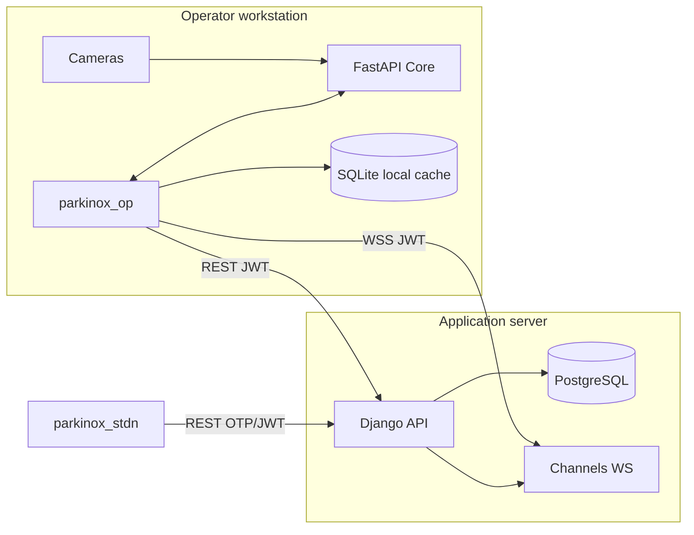

# Architecture

This document describes the technical architecture of Parkinox v3 — how components interact, where data flows, and the design decisions behind the operator-side detection pipeline.

## Design principles

1. **Detection stays local** — YOLO inference and RTSP camera access run on the operator PC via FastAPI. The remote Django server never receives raw video streams.
2. **Separation of concerns** — FastAPI handles computer vision; Django handles business rules, persistence, and multi-user access.
3. **Real-time where it matters** — WebSockets push plate events (local) and parking stats (remote) without polling.
4. **Persian-first** — Plate format, UI (RTL), Jalali calendar, and Vazirmatn typography are first-class.

---

## High-level topology



---

## Component responsibilities

### parkinox_op (Operator Flutter app)

| Concern | Implementation |
|---------|----------------|
| State management | Riverpod (`StateNotifier`, `Provider`) |
| Navigation | GoRouter |
| Local persistence | SharedPreferences, FlutterSecureStorage, SQLite (sqflite FFI on desktop) |
| Django HTTP | Dio with JWT interceptors |
| FastAPI detection WS | `WebSocketService` → `fastApiDetectionControllerProvider` |
| Django panel WS | `websocket_provider` → `ParkingConsumer` |
| Camera preview (IP) | `RtspPreview` (`media_kit`) on RTSP sub-stream (102) |
| Camera capture (USB) | `camera` package → `POST /detect` |
| Plate approval UI | `DetectionApprovalPanel`, countdown timers |

**Key providers:**

| Provider | Role |
|----------|------|
| `fastApiDetectionControllerProvider` | Connects to `ws://localhost:8002/ws`, routes `plate_detected` |
| `entryContinuousDetectionProvider` / `exitContinuousDetectionProvider` | Detection state + approval queue |
| `parkingProvider` | Gate events, sessions, Django sync |
| `settingsProvider` | Endpoints, camera config; syncs to FastAPI on save |
| `plateLookupProvider` | Django plate registration lookup |

### Core (FastAPI + YOLOv5)

| Module | Role |
|--------|------|
| `fastapi_app.py` | HTTP API, WebSocket hub, lifespan hooks |
| `plate_detector.py` | Two-stage YOLO: plate bbox → character decode |
| `camera_stream_service.py` | RTSP threads and periodic detection |

**Camera worker lifecycle:**

```
POST /cameras/config
       │
       ▼
CameraManager.apply_config()
       │
       ├── entry: CameraStream.configure(url, enabled)
       └── exit:  CameraStream.configure(url, enabled)
                │
                ▼
         Thread: cv2.VideoCapture(RTSP)
                │
                └── every 3s → detector.detect(frame)
                              │
                              └── on_detection → WebSocket broadcast
```

**Detection deduplication:** Same plate on same camera is suppressed for 10 seconds (`PLATE_COOLDOWN_SEC`).

### backend (Django)

| App | Role |
|-----|------|
| `accounts` | Operator login, student OTP, JWT refresh |
| `parking` | Gate events, sessions, rates, plate lookup, WebSocket consumer |
| `plates` | Plate registry CRUD |
| `wallets` | Balance, top-up, operator top-up by plate |
| `reports` | Reporting endpoints |

**WebSocket:** `ws://<host>:8001/ws/panel/?token=<JWT>`

Authenticated operator connections receive parking statistics and gate-related events via Django Channels.

### parkinox_stdn (Student Flutter app)

Mobile client for students: OTP auth, plate registration, wallet, session history. Communicates only with Django — no FastAPI dependency.

---

## Detection data flows

### Flow A — IP camera (recommended)

```
RTSP camera
    → OpenCV (FastAPI thread)
    → YOLO detect every 3s
    → WebSocket { type: "plate_detected", data: { plate_number, camera_id, ... } }
    → parkinox_op ingestRemoteDetection()
    → Plate lookup (Django REST)
    → Approval countdown → Gate event (Django REST)
```

Preview path (parallel):

```
RTSP channel 102 → RtspPreview (media_kit hardware decode)
```

### Flow B — USB / webcam

```
CameraController.takePicture()
    → POST /detect (multipart image)
    → PlateDetectionResult
    → continuous_detection_provider._applyDetectionResult()
    → (same approval path as Flow A)
```

### Flow C — Django WebSocket (parking stats)

```
Operator logs in → JWT stored
    → connect ws://django:8001/ws/panel/?token=...
    → ParkingConsumer pushes stats / gate confirmations
    → event_queue_provider / parkingProvider
```

---

## WebSocket message schemas

### FastAPI — `plate_detected`

```json
{
  "type": "plate_detected",
  "data": {
    "event_id": "uuid",
    "plate_number": "12 ب 345 17",
    "camera_id": "entry_camera",
    "confidence": 0.87,
    "char_confidence": 0.82,
    "timestamp": "2026-06-22T10:30:00+00:00",
    "status": "unregistered",
    "bbox": [100, 200, 300, 250]
  }
}
```

`camera_id` values: `entry_camera`, `exit_camera`

### FastAPI — client ping

```json
{ "type": "ping" }
```

Response: `{ "type": "pong" }`

### Django — operator panel

See `backend/parking/consumers.py` for gate confirmation, rejection, heartbeat, and statistics message types.

---

## Configuration sync

When operator saves camera settings in Flutter:

```
SettingsModel
    → FastApiCameraApi.syncCameraConfig()
    → POST /cameras/config
    {
      "entry_enabled": true,
      "entry_url": "rtsp://...",
      "exit_enabled": false,
      "exit_url": null
    }
```

On dashboard bootstrap (`session_bootstrap_provider`):

1. Wait for settings to load
2. `fastApiDetectionController.connect()` — sync config + open WS
3. Django JWT bootstrap (if superuser cached)
4. Django panel WebSocket connect

---

## Security model

| Asset | Protection |
|-------|------------|
| Django JWT | `flutter_secure_storage`, query param on WS |
| RTSP credentials | Stored in local settings; sent only to local FastAPI |
| FastAPI | No auth by default — bind to localhost in production LAN |
| Student OTP | Time-limited codes via Django |
| SQLite local cache | Operator machine filesystem |

**Production recommendations:**

- Run FastAPI on `127.0.0.1` or operator VLAN only
- Django behind HTTPS + WSS reverse proxy (see `DEPLOYMENT_UBUNTU_24.md`)
- Rotate `SECRET_KEY`, use PostgreSQL, disable `DEBUG`
- Restrict CORS on Django; avoid `allow_origins=["*"]` on FastAPI in shared networks

---

## Technology choices

| Decision | Rationale |
|----------|-----------|
| FastAPI over Flask for Core | Async, OpenAPI, WebSocket native, better concurrency |
| Detection on operator PC | Low latency, no video egress, GPU on gate machine |
| media_kit RTSP sub-stream preview | Low-latency hardware decode on operator machine |
| Riverpod | Compile-safe, testable state for complex detection + WS flows |
| SQLite local + Django remote | Offline resilience for operator entries; authoritative server state |
| YOLOv5 two-stage | Proven accuracy on Iranian plate format in this project |

---

## File map (operator detection path)

```
parkinox_op/lib/
├── data/services/
│   ├── fastapi_camera_api.dart      # Config sync, URL builders
│   ├── websocket_service.dart       # FastAPI WS client
│   └── plate_detection_service.dart # POST /detect for USB
├── providers/
│   ├── fastapi_detection_provider.dart
│   ├── continuous_detection_provider.dart
│   └── session_bootstrap_provider.dart
└── ui/
    ├── dashboard/components/camera_panel.dart
    ├── shared/rtsp_preview.dart
    └── settings/widgets/ip_camera_config_field.dart

Core/
├── fastapi_app.py
├── camera_stream_service.py
└── plate_detector.py
```

---

## Future extension points

- JWT auth on FastAPI for multi-operator LAN
- Batch detection endpoint for recorded footage
- Redis channel layer for multi-worker Django
- ONNX export for CPU-only operator machines without CUDA
- Student push notifications on gate events
